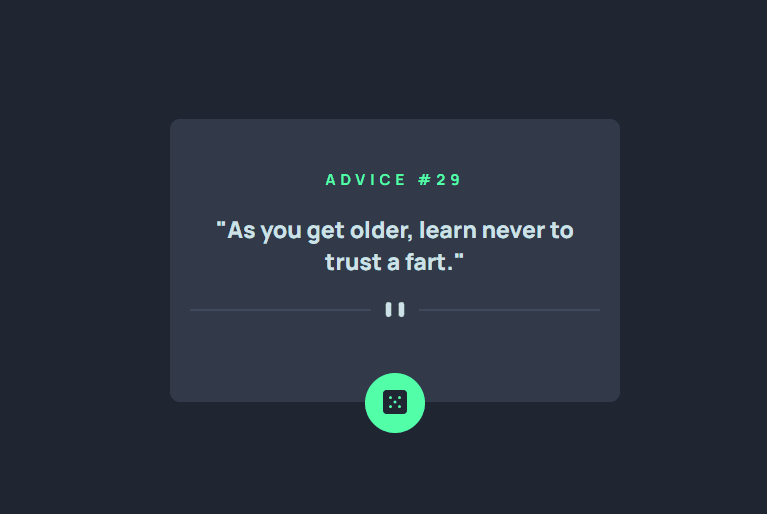

# Advice generator app solution - Frontend Mentor

### This is a solution to the [Advice generator app challenge on Frontend Mentor](https://www.frontendmentor.io/challenges/advice-generator-app-QdUG-13db).

## Technology used

- HTML 
- CSS 
- JS

## What I learned from this project

With this project I improved my knowledge with Javascript using an API, in addition to handling errors using try-catch

 # Social media

 - 👋🏾 [Linkedin](https://www.linkedin.com/in/matheus17martins/)
 - 💻 [Github](https://github.com/ma17martins)